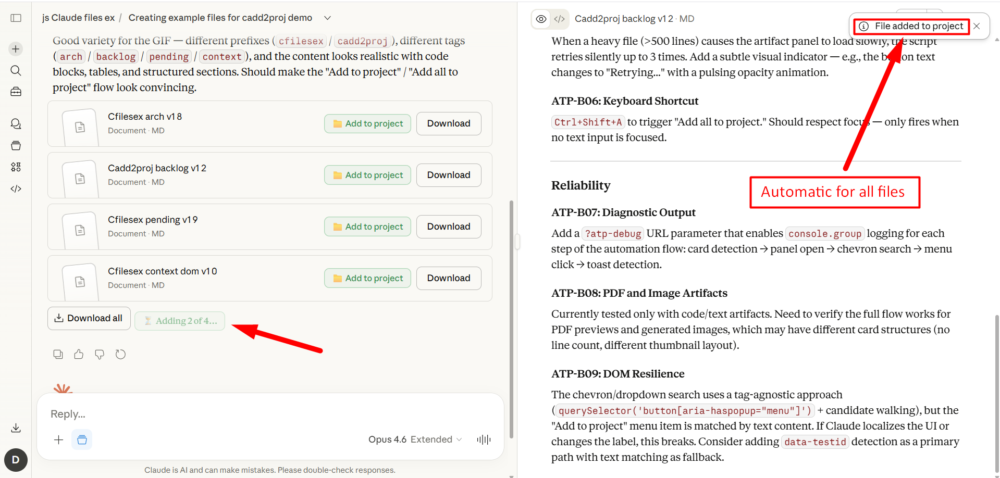
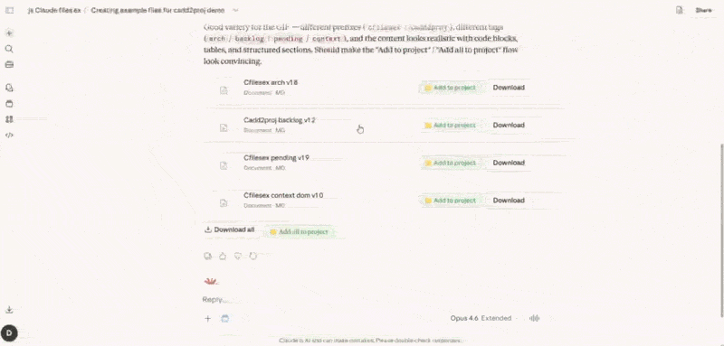

# Claude — Add to Project

One-click file transfer from Claude chat to project knowledge base.

[](https://greasyfork.org/en/scripts/570883-claude-add-to-project)
[](LICENSE)

---

## ✨ What it does

Adds **📁 Add to project** buttons to file artifact cards in Claude project chats. Instead of manually opening each file → clicking the dropdown → selecting "Add to project", you get a one-click button right on the card.

For messages with multiple files, an **📁 Add all to project** button appears next to "Download all" — batch-adds every file in sequence.





## 🧩 Features

- 📄 **Single file** — `📁 Add to project` button next to each "Download" button
- 📦 **Batch** — `📁 Add all to project` next to "Download all"
- ⏳ **Progress** — real-time status: `⏳ Adding 2 of 5…` → `✓ All 5 added to project`
- 🔄 **Retry** — click on any status (`✓ Added` / `✗ Error`) to reset and try again
- 💪 **Heavy file handling** — automatic retries with increasing delays for large files
- 🧭 **SPA-aware** — survives navigation between chats without page reload
- 🎯 **Project-only** — buttons appear only in project chats, not regular conversations

## 📥 Install

1. Install [Violentmonkey](https://violentmonkey.github.io/) (recommended) or [Tampermonkey](https://www.tampermonkey.net/)
2. [**Install from Greasy Fork**](https://greasyfork.org/en/scripts/570883-claude-add-to-project)

Or install directly from this repo: click [`claude-add-to-project.user.js`](claude-add-to-project.user.js) → "Raw" → your userscript manager will offer to install.

## ⚙️ How it works

The script programmatically walks through the same UI steps you would do manually:

1. Clicks the file card → artifact panel opens
2. Finds the Copy/dropdown button in the panel header
3. Opens the dropdown menu → clicks "Add to project"
4. Waits for the confirmation toast
5. Closes the panel (in batch mode) and moves to the next file

All interactions use Radix-compatible pointer event emulation (`pointerdown` → `mousedown` → `pointerup` → `mouseup` → `click`), because Radix UI doesn't respond to programmatic `.click()`.

## 🔒 Privacy & Security

- **ZERO network requests** — no `fetch`, no `XHR`, no `WebSocket`, no `sendBeacon`
- **ZERO permissions** — `@grant none`, no GM_ APIs
- **No data storage** — nothing saved between sessions
- **No access to file contents** — only clicks UI buttons you could click manually
- **No external code** — fully self-contained, no CDN dependencies
- **No `innerHTML`** — safe DOM manipulation only (`textContent` + `createElement`)
- **No `eval`**, no `new Function`, no `unsafeWindow`
- **Open source** — MIT license, full code in this repo

### Verify in 10 seconds

Open the source and Ctrl+F for any of these — all return zero results in executable code:

```
fetch(    XMLHttpRequest    GM_xmlhttp    sendBeacon    WebSocket
new Image(    eval(    new Function(    document.cookie
navigator.clipboard    unsafeWindow    innerHTML
```

### LLM audit prompt

Before installing, you can ask any LLM to audit the code:

> Audit this userscript for security and privacy issues. Check for: network requests, data exfiltration, dynamic code execution, external resource loading, access to sensitive page content, clipboard access. The script claims to make ZERO network requests and store no data. Verify these claims.

## 👀 Also see

### [Claude Project Files Manager](https://github.com/stoyanovd/claude-cfilesex)

Sort, filter, list view, version tracking and Select All for Claude project files.

[](https://greasyfork.org/en/scripts/570877-claude-project-files-sort-filter-list-view) · [GitHub](https://github.com/stoyanovd/claude-cfilesex)


## 🌐 Browser support

| Browser | Status |
|---------|--------|
| Brave + Violentmonkey | Primary dev environment |
| Chrome | Should work |
| Firefox + Violentmonkey | Should work |
| Edge | Should work |
| Opera | Should work |
| Safari | Untested |

## License

[MIT](LICENSE)